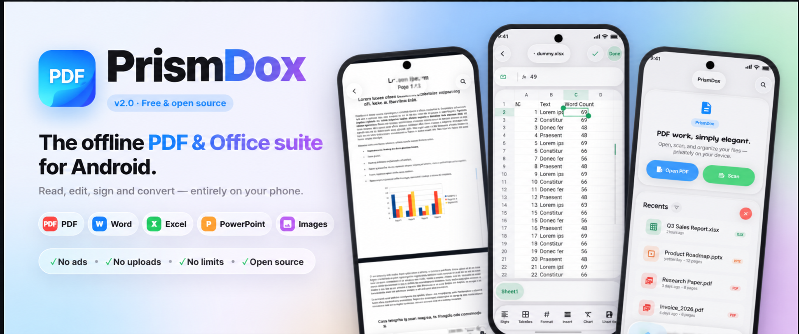

<div align="center">



# PrismDOX

### The free, offline PDF & Office suite for Android — in liquid glass.

Read, edit, sign and convert **PDF, Word, Excel, PowerPoint and images** entirely on your phone.<br>
No ads · No subscription · No file-size limits · No uploads · Open source.

<a href="https://github.com/primearijit/PrismDOX/releases/latest"></a>
<a href="https://github.com/primearijit/PrismDOX/releases"></a>
<a href="https://github.com/primearijit/PrismDOX/releases/latest"></a>
<a href="<a href="https://www.instagram.com/primearijit/">"></a>


</div>

---

## Why PrismDOX?

Most "free" PDF apps and websites upload your files, cap file sizes, watermark output or lock basic tools behind a subscription. PrismDOX does all of it **on-device**, for free, forever.

| | PrismDOX | Typical freemium PDF apps / sites |
|---|:---:|:---:|
| Works fully offline, files never uploaded | ✅ | ❌ |
| No ads, no account, no subscription | ✅ | ❌ |
| No file-size or page limits, no watermarks | ✅ | ❌ |
| PDF **and** Word / Excel / PowerPoint | ✅ | ⚠️ often paid |
| Real spreadsheet & image editors | ✅ | ❌ |
| Open source (MIT) | ✅ | ❌ |

---

## ✨ Features

### 📖 PDF viewer & editor
- Smooth continuous scrolling, pinch-zoom and a fast page scrubber
- **Native-feeling text selection** — long-press any word, drag handles with a magnifier across lines and pages; copy, share, search or translate
- Annotate: highlight, underline, strikethrough, pen, shapes, arrows, text boxes and sticky notes
- Sign documents, fill forms, add page numbers and watermarks, flatten
- Search inside documents, OCR for scanned pages (on-device)

### 🧰 PDF tools
Merge · Split · Extract pages · Organize (reorder, rotate, delete) · Compress · Encrypt / decrypt · Images → PDF · PDF → images · HTML → PDF · Extract text · Create PDF — all **lossless** where possible.

### 📊 Spreadsheet editor (xlsx)
- Faithful Excel rendering: fills, fonts, borders, merged cells, frozen panes, column widths, theme colours
- Edit cells with a formula bar, format with a colour picker, use dropdown (data-validation) cells
- Insert / delete rows and columns, undo / redo, save back to **.xlsx** without breaking the rest of the file

### 🖼️ Image editor
Crop, straighten, perspective, shape masks · 13 adjustments · 22 filters · brushes, shapes, arrows, blur & pixelate · text · **background removal** · watermark · resize & format · EXIF viewer / stripper. Non-destructive with full undo / redo.

### 📄 Word, PowerPoint & more
Open **docx, doc, odt, rtf, pptx, ppt, xlsx, xls** and more. Optionally download the **Office engine (powered by LibreOffice)** in Settings for pixel-faithful Office rendering — it runs in its own sandboxed process and never leaves your device.

### 📷 Document scanner
Edge-detecting scanner that turns paper into clean, searchable PDFs.

### 💎 Liquid glass design
A custom liquid-glass design system for Android — real refraction, blur and light, adaptive light & dark themes, and fluid spring animations throughout.

### 🔒 Private by design
No ads, no analytics, no accounts. Your documents are processed on your phone. See [PRIVACY.md](PRIVACY.md).

---

## 📱 Screenshots

<div align="center">
  
  
  
  
</div>
<div align="center">
  
  
  
  
</div>

🎬 Video walkthroughs: [onboarding](demo/1.mp4) · [PDF viewer](demo/2.mp4)

---

## ⬇️ Download

Grab the APK from the **[latest release](https://github.com/primearijit/PrismDOX/releases/latest)**:

| APK | For |
|---|---|
| `PrismDOX-vX-arm64-v8a.apk` | Almost every modern phone (recommended) |
| `PrismDOX-vX-armeabi-v7a.apk` | Older 32-bit phones |
| `PrismDOX-vX-universal.apk` | Not sure? This one works everywhere (larger) |

Get automatic updates with **[Obtainium](https://github.com/ImranR98/Obtainium)** — add `https://github.com/primearijit/PrismDOX`.

---

## ❓ FAQ

<details>
<summary><b>Is PrismDOX really free? What's the catch?</b></summary>

It's free and open source under the MIT license. There are no ads, no in-app purchases and no data collection.
</details>

<details>
<summary><b>Does it upload my documents?</b></summary>

No. Every PDF, Office and image operation runs on your device. The only optional network use is downloading the Office engine when you ask for it (sideload builds), verified by SHA-256.
</details>

<details>
<summary><b>Can it edit Excel / Word / PowerPoint files?</b></summary>

Spreadsheets (.xlsx) can be edited and saved. Word and PowerPoint files open in the viewer and can be annotated, exported and shared as PDF. A PowerPoint editor is on the roadmap.
</details>

<details>
<summary><b>Is it an alternative to Adobe Acrobat, iLovePDF or Smallpdf?</b></summary>

For everyday tasks — reading, annotating, signing, merging, splitting, compressing, converting — yes, and without uploads, limits or subscriptions.
</details>

---

## 🛠️ Build from source

Requires JDK 17+ and Android SDK 36.

```bash
git clone https://github.com/primearijit/PrismDOX.git
cd PrismDOX 
./gradlew assembleFossRelease   # sideload APKs (per-ABI + universal)
./gradlew bundlePlayRelease     # Google Play bundle
```

Two product flavors share one `applicationId`:

- **`foss`** — GitHub / sideload builds. The optional Office engine downloads in-app on request, pinned and SHA-256 verified.
- **`play`** — Google Play. The Office engine ships as the on-demand dynamic feature `:office_engine`; its binaries are fetched and verified only by `bundlePlay*` tasks.

Debug: `assembleFossDebug`, `installFossDebug`, `assemblePlayDebug`. Release builds fall back to debug signing unless local signing credentials are configured — never commit `key.properties` or keystores.

**Stack:** Kotlin · Jetpack Compose · PdfBox-Android · Android PdfRenderer · ML Kit · LibreOfficeKit (optional) · GPUImage · custom liquid-glass backdrop engine.

---

## 🤝 Contributing

Bug reports, ideas and pull requests are welcome — see [CONTRIBUTING.md](CONTRIBUTING.md) and use the issue templates.

If PrismDOX saves you from a subscription, **⭐ star the repo** and share it — it genuinely helps others find it.

[](https://github.com/sponsors/primearijit)

---

## 🙌 Credits

- [AndroidLiquidGlass](https://github.com/Kyant0/AndroidLiquidGlass) by Kyant0 — backdrop / liquid-glass effects (Apache-2.0)
- [AndroidLiquidGlassView](https://github.com/QmDeve/AndroidLiquidGlassView) by QmDeve — motion techniques (MIT)
- [PdfBox-Android](https://github.com/TomRoush/PdfBox-Android) by Tom Roush — lossless PDF operations (Apache-2.0)
- [ImageToolbox](https://github.com/T8RIN/ImageToolbox) by T8RIN — image-editor cropper and draw engine (Apache-2.0)
- [GPUImage for Android](https://github.com/cats-oss/android-gpuimage) — image filters (Apache-2.0)
- [LibreOffice](https://www.libreoffice.org/) — optional Office engine (MPL-2.0), downloaded on request, not bundled

Full notices: [THIRD_PARTY_NOTICES.md](THIRD_PARTY_NOTICES.md).

## 📄 License

[MIT](LICENSE) © 2026 primearijit

<sub>Keywords: offline PDF editor Android, free PDF reader, PDF annotator, PDF signer, merge PDF, split PDF, compress PDF, docx viewer, xlsx editor, spreadsheet editor, pptx viewer, image editor, background remover, document scanner, open source Adobe Acrobat alternative, iLovePDF alternative, Smallpdf alternative, liquid glass UI, Jetpack Compose.</sub>
